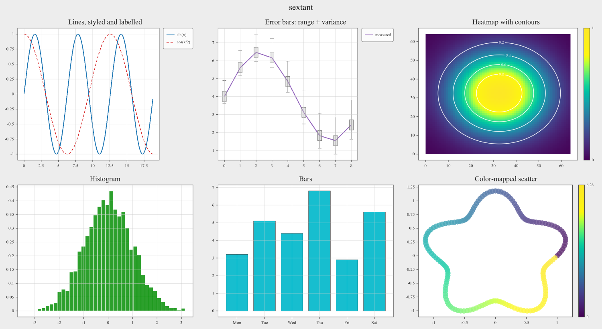
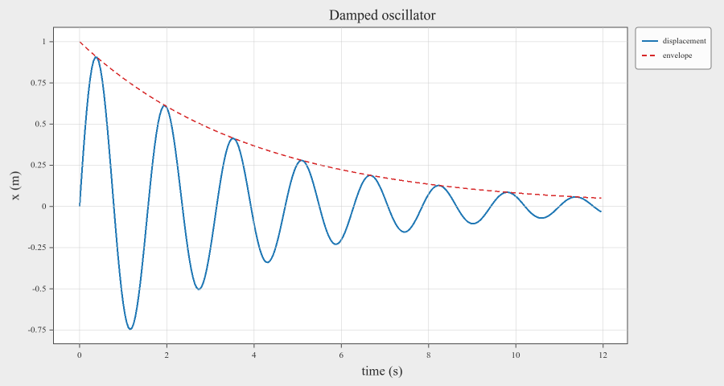

# sextant

**Plotting for C++ that doesn't get in the way.**

sextant is a C++20 library for scientific data visualization. It exists so that
looking at your data is as cheap in C++ as it is in Python: three lines to a
window, no notebook, no export step, no separate process.

```cpp
fig->axes()->line(t, signal, {.color = sextant::Color::Blue, .label = "x(t)"}).grid();
fig->show(pause=false);          // window opens, your thread keeps going
```

Aimed at engineers who want to see what a simulation is doing while it runs, or
to inspect an array during a debugging session, without leaving the C++ ecosystem.

**Version 0.3** · Windows and Linux · MIT licensed



---

## Why you might want it

- **`show(pause=false)` returns immediately.** The window runs itself on its own thread.
  Your program keeps computing, and calls `refresh()` when it has something new
  to show. There is no event loop to hand your `main()` over to.
- **Designated initializers instead of a parameter soup.** `{.color = ...,
  .linewidth = 2.0f, .label = "fit"}` — you name what you set and nothing else,
  and the compiler checks it.
- **A control panel comes with the window.** Titles, limits, ticks, colours,
  fonts and the plot data itself are all editable live, and the figure can be
  saved from the File menu at any size.
- **A data panel editable and shaded** Values in coordinates vectors and heatmap matrix 
  can be inspected easily, editing updated to the plots live, with numeric formatting and colour shading.
- **What you see is what you save.** The window, the PNG and the SVG go through
  one layout pass and one set of definitions, so a saved file matches the
  screen rather than approximating it.
- **Stays interactive at scale.** A million-point line pans and zooms, with custom 
  mouse hint enabled; geometry is cached against a data generation counter, 
  so redrawing a static plot re-uploads nothing.


## Quick start

```cpp
#include <sextant/sextant.h>
#include <cmath>
#include <vector>

int main() {
    std::vector<double> t(300), signal(300), envelope(300);
    for (int i = 0; i < 300; ++i) {
        t[i]        = i * 0.04;
        envelope[i] = std::exp(-0.25 * t[i]);
        signal[i]   = envelope[i] * std::sin(4.0 * t[i]);
    }

    auto fig = sextant::Figure::create({.width = 900, .height = 480});
    fig->axes()
        ->line(t, signal,   {.color = sextant::Color::Blue, .linewidth = 2.0f,
                             .label = "displacement"})
        .line(t, envelope,  {.color = sextant::Color::Red,
                             .linestyle = sextant::LineStyle::Dashed,
                             .label = "envelope"})
        .set_title("Damped oscillator")
        .set_xtitle("time (s)")
        .set_ytitle("x (m)")
        .legend()
        .grid();

    fig->savefig("quickstart.png");   // or fig->show(); for a live window
}
```



That image is the output of exactly the program above.

## Plot types

| | |
|---|---|
| `line` | Polylines, solid or dashed, any width. Millions of points. |
| `scatter` | Six marker shapes, per-series colour and size. |
| `scatter_z` | Scatter whose colour comes from a third value, with a colorbar. |
| `bar` | Bar charts, positive or diverging, with edges. |
| `hist` | Histograms — binning on top of the same bar plot, with `density` and `cumulative`. |
| `heatmap` | Colour-mapped matrices, optionally with traced and labelled **contour lines**. |
| error bars | A capped whisker for an observed range plus a box for a spread, on lines, bars and both scatter kinds. |
| decoration | Titles, axis titles, legends, colorbars, grids, a figure-wide suptitle, explicit ticks, per-element fonts and colours. |
| layout | `add_subplot(rows, cols, index)` grids, sized by the figure *or* by the plot frame you want. |

## Output

- **A live window** — pan, zoom, hover for values, edit the plot, save from the
  File menu.
- **PNG** — supersampled and box-filtered, identical to what the window shows.
- **SVG** — vector, resolution-independent, and written with **no OpenGL context at all**, perfect for a headless server.

```cpp
fig->savefig("out.png");   // format comes from the extension
fig->savefig("out.svg");
```

## Building

### Requirements

- A C++20 compiler — MSVC 19.4x, or GCC/Clang with C++20 support
- CMake 3.21 or newer
- OpenGL 4.1 core

Everything else is either vendored, fetched, or optional. GLFW is downloaded and
built automatically.

### Third-party sources

```bash
scripts/setup_deps.sh
```

This populates `third_party/` with Dear ImGui, NanoVG and stb.

GLAD is a one-time manual download. Generate it at
[glad.dav1d.de](https://glad.dav1d.de/) with **OpenGL 4.1 Core** and
**GLAD v1** (not glad2), then extract it so you have:

```
third_party/glad/include/glad/glad.h
third_party/glad/include/KHR/khrplatform.h
third_party/glad/src/glad.c
```

### Build

```bash
git clone https://github.com/<your-org>/sextant.git
cd sextant
scripts/setup_deps.sh
cmake -S . -B build -DCMAKE_BUILD_TYPE=Release
cmake --build build
```

On Windows, run that from a `vcvars64` shell.

### Install

sextant is consumed as an installed package, not added to your build with
`add_subdirectory`. Install it once:

```bash
cmake --build build --target install_dist
```

`install_dist` is a convenience target that installs into **`dist/`** beside the
source tree, so you can try the library without touching a system directory. It
gives you:

```
dist/include/sextant/     the public headers
dist/lib/                 the import library, the static library, and the
dist/lib/cmake/sextant/   CMake package files find_package() looks for
dist/bin/                 sextant.dll   (Windows; the .so lands in lib/ on Linux)
```

Both Debug and Release can live in one prefix side by side — install from each
build directory and `find_package` picks the right one per configuration.

Point it somewhere else with `-DSEXTANT_LOCAL_INSTALL_PREFIX=/path/to/prefix`,
or skip the target entirely and use CMake's own installer:

```bash
cmake --install build --prefix /usr/local        # or any prefix you like
```

### Use it from your project

Tell CMake where you installed it, then ask for the package:

```cmake
cmake_minimum_required(VERSION 3.21)
project(my_app CXX)
set(CMAKE_CXX_STANDARD 20)
set(CMAKE_CXX_STANDARD_REQUIRED ON)

# Where `install_dist` (or `cmake --install`) put sextant.
set(sextant_INSTALL_PREFIX "/path/to/sextant/dist" CACHE PATH "sextant prefix")
list(APPEND CMAKE_PREFIX_PATH "${sextant_INSTALL_PREFIX}")

find_package(sextant CONFIG REQUIRED)

add_executable(my_app main.cpp)
target_link_libraries(my_app PRIVATE sextant::sextant)

# Windows: put sextant.dll next to the executable so it runs without PATH edits.
if(WIN32)
    add_custom_command(TARGET my_app POST_BUILD
        COMMAND ${CMAKE_COMMAND} -E copy_if_different
                $<TARGET_FILE:sextant::sextant> $<TARGET_FILE_DIR:my_app>)
endif()
```

If you installed to a system prefix that CMake already searches, the
`CMAKE_PREFIX_PATH` line is unnecessary. You can also pass the prefix on the
command line instead of hardcoding it:

```bash
cmake -S . -B build -DCMAKE_PREFIX_PATH=/path/to/sextant/dist
```

`sextant::sextant` is the shared library, and `sextant.dll` is the only file you
need beside your executable: FreeType, libpng, zlib and GLFW are all linked into
it, so it depends on nothing but OS DLLs and the MSVC runtime.
`sextant::sextant_static` is also installed if you would rather link statically
— see the [API guide](doc/api.md#linking) for the one vcpkg triplet caveat that
comes with it.

### Options

| Option | Default | Effect |
|---|---|---|
| `SEXTANT_USE_FREETYPE` | `ON` | FreeType glyph rasterization; `OFF` falls back to stb_truetype |
| `SEXTANT_USE_LIBPNG` | `ON` | libpng output; `OFF` falls back to stb_image_write |
| `SEXTANT_FETCH_GLFW` | `ON` | Download and build GLFW; `OFF` uses an installed one |
| `SEXTANT_BUILD_STATIC` | `ON` | Also build `sextant_static` |
| `SEXTANT_BUILD_TESTS` | `ON` | Build the test executables |

## Documentation

**[doc/api.md](doc/api.md)** is the user guide and full API reference: every
method, every option struct, the interactive window, threading rules and error
handling.

## Dependencies

| | | |
|---|---|---|
| [GLFW](https://www.glfw.org/) 3.4 | zlib/libpng | fetched and statically linked |
| [Dear ImGui](https://github.com/ocornut/imgui) | MIT | vendored |
| [NanoVG](https://github.com/memononen/nanovg) | zlib | vendored |
| [stb](https://github.com/nothings/stb) | public domain | vendored |
| [GLAD](https://glad.dav1d.de/) | MIT / public domain | vendored |
| [Roboto](https://fonts.google.com/specimen/Roboto) | Apache-2.0 | vendored (panel UI font) |
| [FreeType](https://freetype.org/) | FTL | system; optional |
| [libpng](http://www.libpng.org/pub/png/libpng.html) | libpng | system; optional |
| [GLM](https://github.com/g-truc/glm) | MIT | system |

## Not in this version

3D plots, remote rendering, and integration with Qt/GTK/wxWidgets.

**macOS is out of scope**, and not by oversight: AppKit requires window creation
and event polling on the process main thread, which is incompatible with
`show()` returning immediately while the window runs on its own thread.
Supporting it means a second threading model, not a port.

## License

MIT — see [LICENSE](LICENSE).

sextant bundles and links several third-party components, all permissively
licensed. Their notices, and the credit FreeType asks for, are in
[THIRD_PARTY_NOTICES.md](THIRD_PARTY_NOTICES.md). Ship that file with any binary
that embeds sextant.
