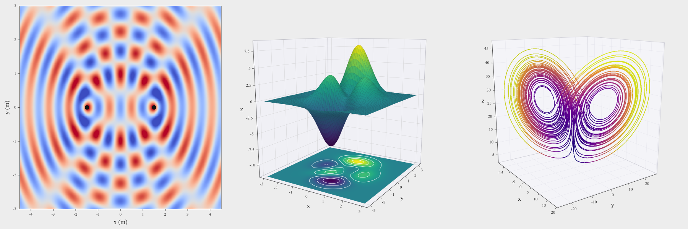
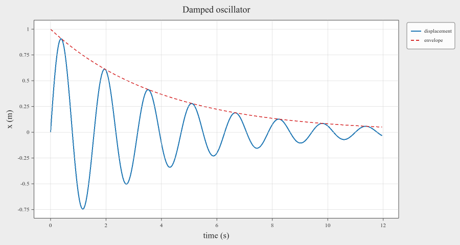
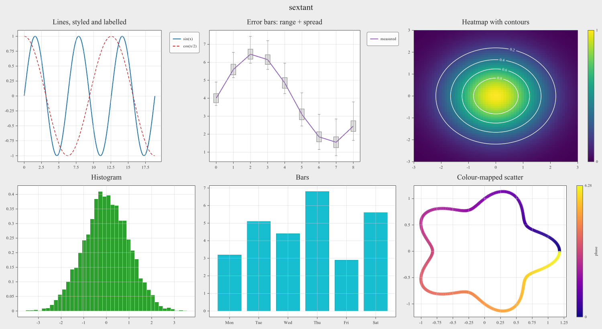
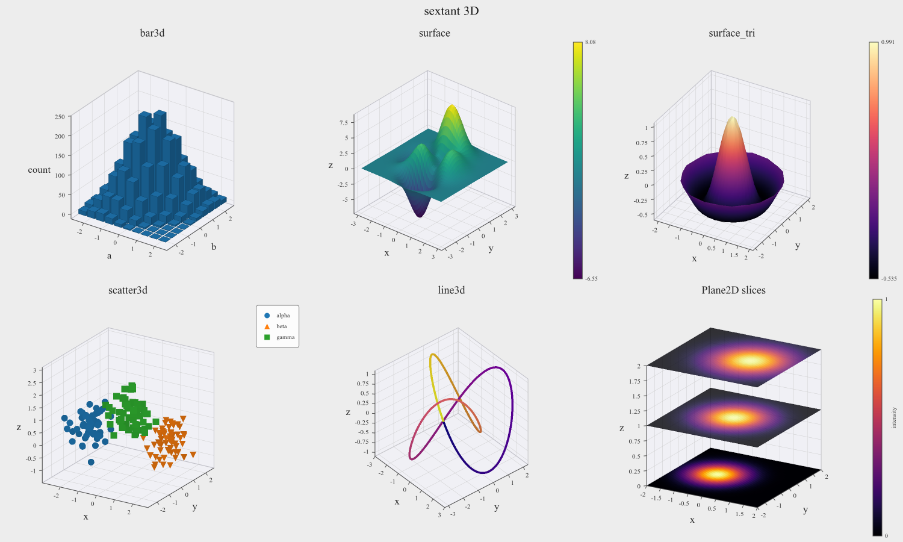

<p align="center">
  <picture>
    
    <source media="(prefers-color-scheme: dark)" srcset="doc/icons/sextant-logo-dark.svg">
  </picture>
</p>

<p align="center"><b>Plotting for C++ that never gets in the way.</b></p>

<p align="center">
  <a href="https://github.com/BackslashStudio/sextant/actions/workflows/ci.yml?query=branch%3Amain"></a>
  <a href="https://github.com/BackslashStudio/sextant/releases/latest"></a>
  
  
  <a href="LICENSE"></a>
</p>



sextant is a C++20 library for scientific data visualization. It exists so that
looking at your data is as cheap in C++ as it is in Python: a few lines to a
window, no notebook, no export step, no separate process.

```cpp
fig->axes()->line(t, signal, {.color = sextant::Color::Blue, .name = "x(t)"}).grid();
fig->show(false);          // window opens, your thread keeps going
```

Aimed at engineers who want to see what a simulation is doing while it runs, or
to inspect an array during a debugging session, without leaving the C++ ecosystem.

---

## Why you might want it

- **`show(false)` returns immediately.** The window runs on its own thread. Your
  program keeps computing, updates the data in place, and calls `refresh()` when
  it has something new to show. There is no event loop to hand `main()` over to.
- **Designated initializers instead of a parameter soup.** `{.color = ...,
  .linewidth = 2.0f, .name = "fit"}`: you name what you set and nothing else,
  and the compiler checks it.
- **2D and 3D in one grid.** A 3D scene is just another subplot. It holds bars,
  surfaces, meshes, point clouds, paths, and 2D planes carrying any 2D plot, and
  orbits, pans and zooms with the mouse.
- **A control panel and a data panel come with the window.** Titles, limits,
  ticks, colours and fonts are editable live; so is the data itself, in shaded
  tables, with every edit redrawn as you type.
- **What you see is what you save.** The window, the PNG and the SVG go through
  one layout pass, so a saved file matches the screen rather than approximating
  it. Overlapping translucent 3D geometry is ordered exactly in both files.
- **Stays interactive at scale.** A million-point line pans and zooms smoothly;
  geometry is cached against a data generation counter, so redrawing a static
  plot re-uploads nothing.
- **Hands your data straight in.** Every plot call takes `std::span<const double>`,
  so a `std::vector`, a `std::array`, a C array or an Armadillo `arma::vec`
  goes in as it is, with no conversion on your side.

## Quick start

```cpp
#include <sextant/sextant.h>
#include <cmath>
#include <vector>

int main() {
    std::vector<double> t(300), signal(300), envelope(300);
    for (int i = 0; i < 300; ++i) {
        t[i]        = i * 0.04;
        envelope[i] = std::exp(-0.25 * t[i]);
        signal[i]   = envelope[i] * std::sin(4.0 * t[i]);
    }

    auto fig = sextant::Figure::create({.width = 900, .height = 480});
    fig->axes()
        ->line(t, signal,   {.color = sextant::Color::Blue, .linewidth = 2.0f,
                             .name = "displacement"})
        .line(t, envelope,  {.color = sextant::Color::Red,
                             .linestyle = sextant::LineStyle::Dashed,
                             .name = "envelope"})
        .set_title("Damped oscillator")
        .set_xtitle("time (s)")
        .set_ytitle("x (m)")
        .legend()
        .grid();

    fig->savefig("quickstart.png");   // or fig->show(); for a live window
}
```



## Watch it run

Plot once, then replace the data in place and publish it. The window keeps up on
its own thread; closing it ends the loop.

```cpp
auto fig = sextant::Figure::create();
auto ax  = fig->axes();
ax->line(x, y);
fig->show(false);

while (!fig->wait_closed(1.0 / 60)) {   // until the window is closed
    simulate_step(y);
    ax->set_line_data(0, x, y);         // keeps titles, limits and styles
    fig->refresh();
}
```

## 2D plots



|                     |                                                                                                                           |
|---------------------|---------------------------------------------------------------------------------------------------------------------------|
| `line`              | Polylines, solid, dashed, dotted or dash-dot, any width, open or closed. Millions of points.                              |
| `scatter`           | Six marker shapes, per-series colour and size.                                                                            |
| `scatter_z`         | Scatter whose colour comes from a third value, with a colorbar.                                                           |
| `bar`               | Bar charts, positive or diverging, with edges.                                                                            |
| `hist`              | Histograms: binning on top of the same bar plot, with `density` and `cumulative`.                                         |
| `heatmap`, `imshow` | Colour-mapped matrices over real coordinates or indices, with traced and labelled **contour lines**.                      |
| error bars          | A capped whisker for an observed range plus a box for a spread, one- or two-sided, on lines, bars and both scatter kinds. |

## 3D plots



```cpp
auto ax3 = fig->add_subplot3d(1, 2, 2);          // beside a 2D cell in the same grid
ax3->surface(sextant::PlaneOrientation::XY, x, y, heights,
             {.colormap = true, .colorbar = true});
ax3->plane(sextant::PlaneOrientation::XY, -10.0) // a 2D plane inside the scene
   ->heatmap(field, rows, cols, {-3, 3}, {-3, 3});
```

|               |                                                                                              |
|---------------|----------------------------------------------------------------------------------------------|
| `bar3d`       | Bars on a grid, standing along any axis, stackable with per-bar bases.                       |
| `surface`     | A sheet over a grid, flat or colour-mapped by height, with an optional wireframe.            |
| `surface_tri` | A sheet on a triangle mesh: give the triangles, or let sextant triangulate scattered points. |
| `scatter3d`   | Markers in space, flat or colour-mapped, with depth shading.                                 |
| `line3d`      | A path through space, flat or colour-mapped along its length, open or closed.                |
| `Plane2D`     | A plane in the scene carrying any 2D plot: heatmaps, lines, scatter and bars.                |
| error bars    | Whiskers and boxes on `scatter3d` and `line3d`, along any axis.                              |
| camera        | Orthographic or perspective, orbit, pan and zoom, a box of any aspect.                       |

Anything can be translucent: bars through a sheet through a plane are ordered
correctly per pixel in the PNG and per polygon in the SVG.

## And the rest

- **Layout.** `add_subplot(rows, cols, index)` grids, cells spanning several
  columns or rows, adjustable column and row ratios, and a figure sized by the
  whole *or* by the plot frame you want.
- **Decoration.** Titles, axis titles, legends inside or outside the frame,
  colorbars on any side, grids, a figure-wide suptitle, explicit ticks and tick
  labels, axes that cross at any point, per-element fonts and colours.
- **Colormaps.** Viridis, Plasma, Inferno, Magma, Cividis, Turbo, Coolwarm and Gray,
  matching matplotlib's.
- **Read-back.** Every plot's data, the titles and the limits as drawn can be read
  back, including what the user edited in the window.

## Output

- **A live window: `fig->show()`.** Pan, zoom, orbit, hover for values, edit the
  plot and its data, save from the File menu.
- **PNG: `fig->savefig("out.png")`.** Supersampled, at any DPI: `{.dpi = 192}`
  writes the same layout at twice the pixels.
- **SVG: `fig->savefig("out.svg")`.** Vector, resolution-independent, 3D
  included, and written with **no OpenGL context at all**, so it works on a
  headless server.

## Building

You need CMake 3.21 or newer and a C++20 compiler; the window needs OpenGL 4.1.
Everything else is vendored or downloaded on the first configure. Each recipe
below builds the library and installs it into `dist/` beside the source tree.

**Windows** (MSVC 2022 or later, from a `vcvars64` shell)

```bat
cmake -S . -B build -G Ninja -DCMAKE_BUILD_TYPE=Release
cmake --build build --target install_dist
```

That uses sextant's built-in text and PNG fallbacks. For FreeType and libpng,
install them with [vcpkg](https://vcpkg.io) and pass its toolchain file; they are
linked into `sextant.dll`:

```bat
vcpkg install freetype:x64-windows-static-md libpng:x64-windows-static-md zlib:x64-windows-static-md
cmake -S . -B build -G Ninja -DCMAKE_BUILD_TYPE=Release ^
      -DCMAKE_TOOLCHAIN_FILE=C:/path/to/vcpkg/scripts/buildsystems/vcpkg.cmake
cmake --build build --target install_dist
```

**Linux** (GCC or Clang)

```bash
sudo apt-get install ninja-build libfreetype-dev libpng-dev libgl-dev     libx11-dev libxrandr-dev libxinerama-dev libxcursor-dev libxi-dev libxext-dev     libwayland-dev libxkbcommon-dev wayland-protocols
cmake -S . -B build -G Ninja -DCMAKE_BUILD_TYPE=Release
cmake --build build --target install_dist
```

**macOS** (11 or later, Apple Silicon, with the Command Line Tools)

```bash
brew install cmake ninja
cmake -S . -B build -G Ninja -DCMAKE_BUILD_TYPE=Release
cmake --build build --target install_dist
```

Then use it from your project:

```cmake
list(APPEND CMAKE_PREFIX_PATH "/path/to/sextant/dist")
find_package(sextant CONFIG REQUIRED)
target_link_libraries(my_app PRIVATE sextant::sextant)
```

On Windows and macOS the shared library is the only file you need at runtime; on
Linux it also uses the system's FreeType and libpng. Build options, other install
locations and static linking are in the [build guide](doc/build.md).

## Documentation

**[doc/api.md](doc/api.md)** is the user guide and full API reference: every
method, every option struct, the interactive window, threading rules and error
handling.

## Dependencies

|                                                     | License             |                                     |
|-----------------------------------------------------|---------------------|-------------------------------------|
| [GLFW](https://www.glfw.org/) 3.4                   | zlib/libpng         | fetched and statically linked       |
| [Dear ImGui](https://github.com/ocornut/imgui)      | MIT                 | vendored                            |
| [NanoVG](https://github.com/memononen/nanovg)       | zlib                | vendored                            |
| [stb](https://github.com/nothings/stb)              | public domain       | vendored                            |
| [GLAD](https://glad.dav1d.de/)                      | MIT / public domain | vendored                            |
| [Roboto](https://fonts.google.com/specimen/Roboto)  | Apache-2.0          | vendored (panel UI font)            |
| [FreeType](https://freetype.org/)                   | FTL                 | system (fetched on macOS); optional |
| [libpng](http://www.libpng.org/pub/png/libpng.html) | libpng              | system (fetched on macOS); optional |

## License

MIT; see [LICENSE](LICENSE).

sextant bundles and links several third-party components, all permissively
licensed. Their notices, and the credit FreeType asks for, are in
[THIRD_PARTY_NOTICES.md](THIRD_PARTY_NOTICES.md). Ship that file with any binary
that embeds sextant.

## Not in scope

Remote rendering, and embedding in Qt, GTK or wxWidgets applications.
