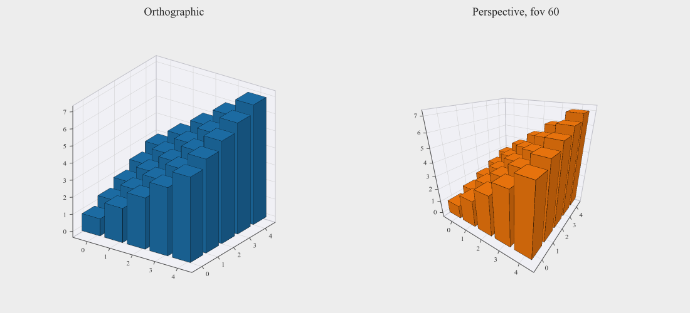
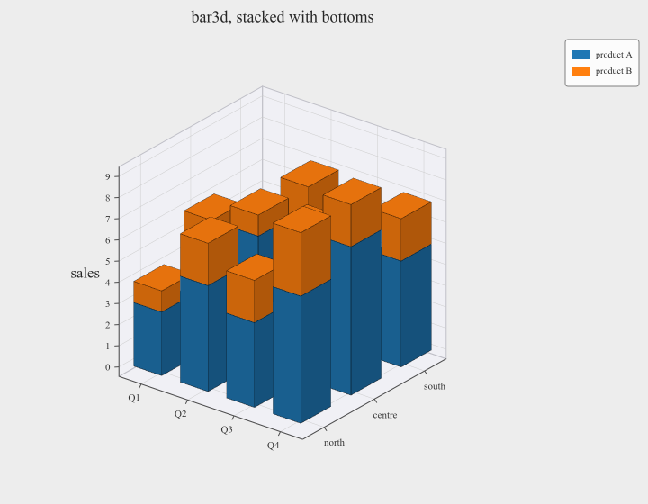
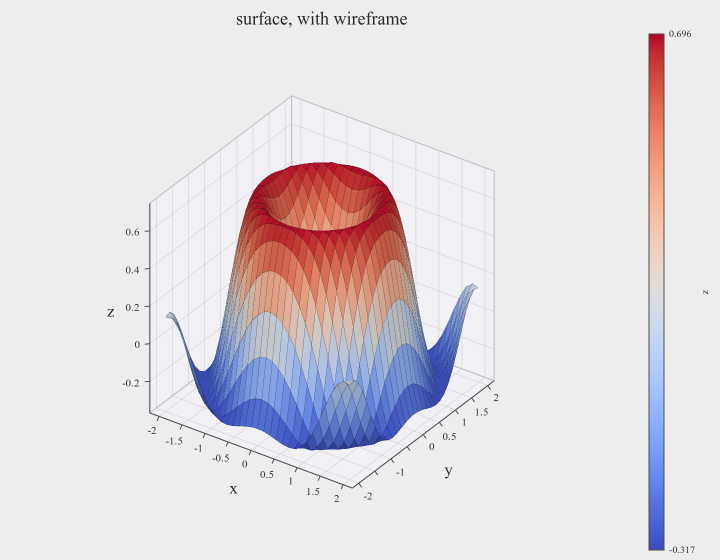
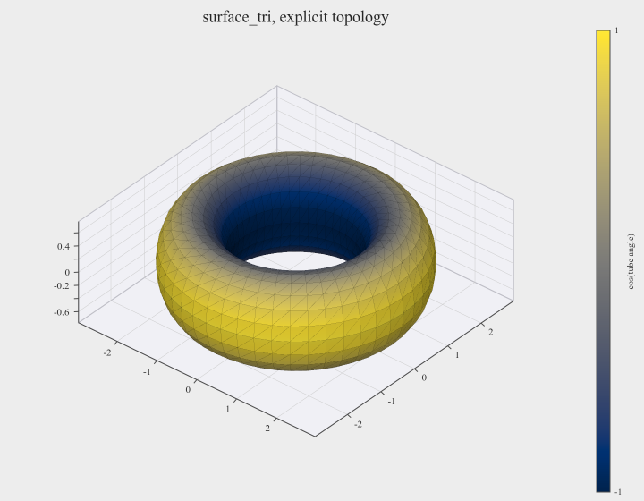
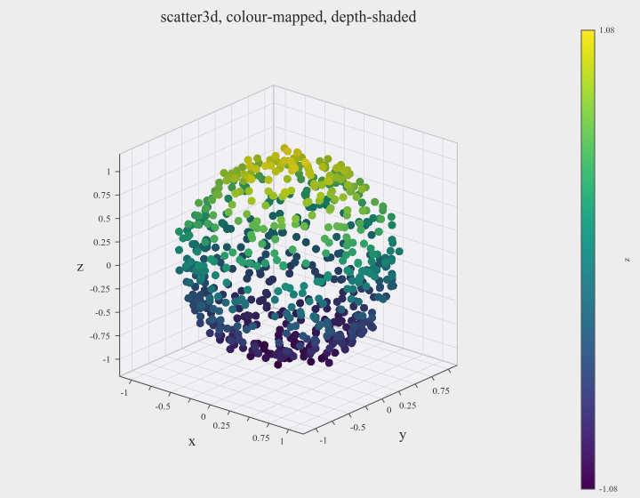
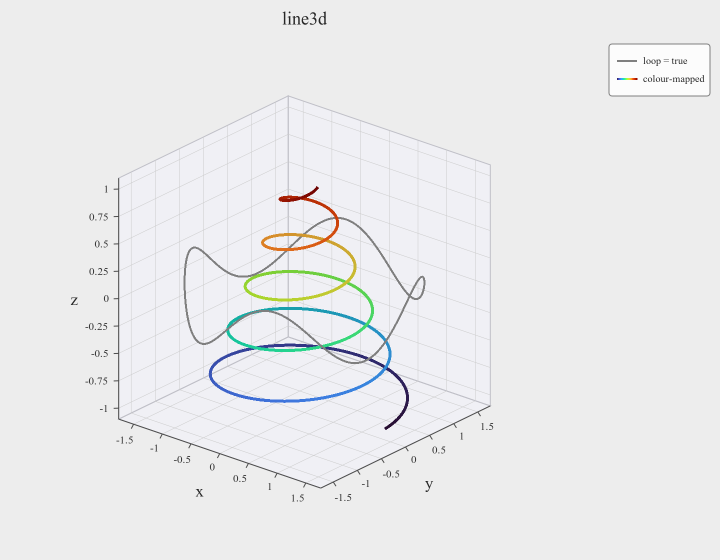
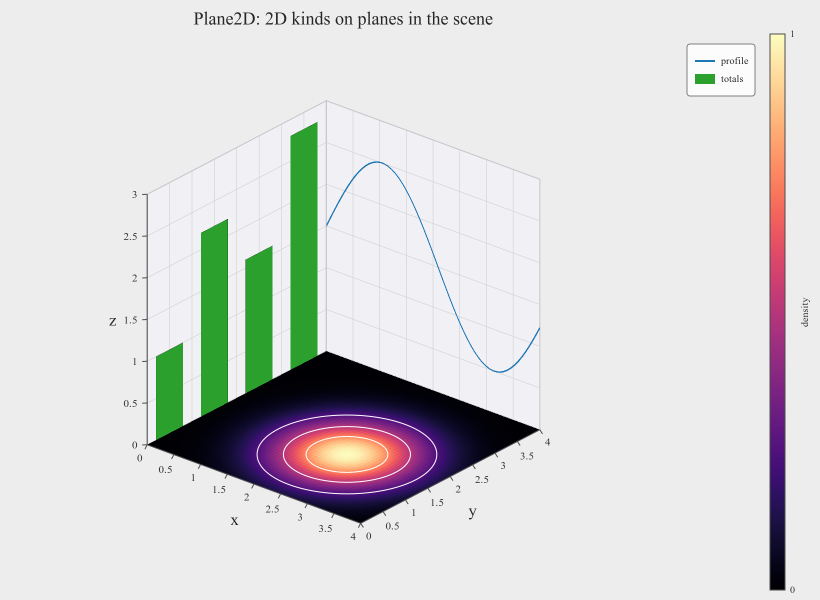
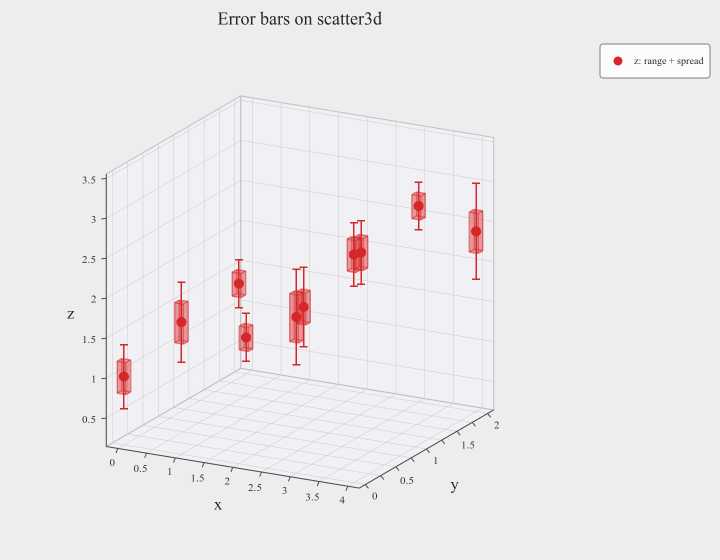
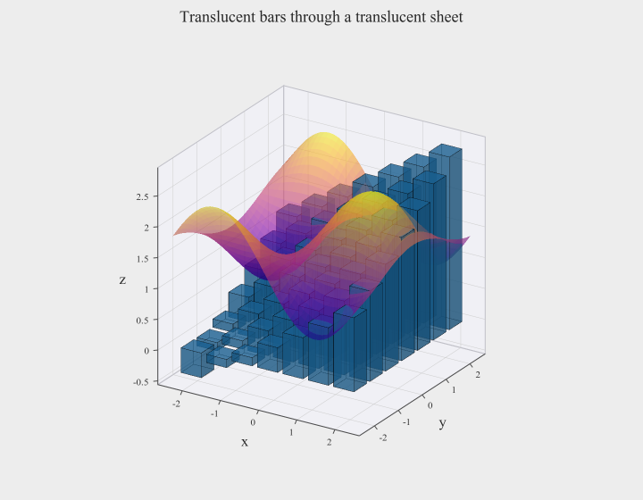

# 3D plots

A 3D scene is one more kind of cell in a figure's subplot grid. It holds bars,
surfaces, triangle meshes, point clouds and paths, plus 2D planes carrying any 2D
plot, and it draws in the window, in PNG and in SVG. This page assumes the
[API guide](api.md); every option field is in [reference.md](reference.md#3d-options).

- [An `Axes3D` in the grid](#an-axes3d-in-the-grid)
- [Camera](#camera)
- [bar3d](#bar3d) · [surface](#surface) · [surface_tri](#surface_tri) ·
  [scatter3d](#scatter3d) · [line3d](#line3d)
- [Plane2D: 2D plots in the scene](#plane2d-2d-plots-in-the-scene)
- [Error bars](#error-bars)
- [Translucency and depth order](#translucency-and-depth-order)
- [Box, axes, legend and colorbars](#box-axes-legend-and-colorbars)
- [Live updates and reading back](#live-updates-and-reading-back)
- [Errors](#errors)
- [Known limitations](#known-limitations)

---

## An `Axes3D` in the grid

```cpp
auto fig = sextant::Figure::create({.width = 1100, .height = 520});
fig->add_subplot(1, 2, 1)->line(t, y).set_title("2D");

auto ax3 = fig->add_subplot3d(1, 2, 2);
ax3->bar3d(sextant::PlaneOrientation::XY, x, y, counts)
    .set_title("3D")
    .set_xtitle("wavelength (nm)").set_ytitle("offset").set_ztitle("counts")
    .set_view(-55.0, 25.0);
```

`add_subplot3d()` takes the same arguments as `add_subplot()` (a cell, a span, or
the shape-less forms) under the same grid rules, and returns a
`std::shared_ptr<Axes3D>`. An `Axes3D` is a sibling of `Axes`, not a subclass: it
has the decoration you would expect (`set_title`, `set_x/y/ztitle`,
`set_x/y/zlim`, `set_x/y/zticks`, `grid`, `set_axes_style`, `legend`,
`set_colorbar_style`, `cla`) and its own plot methods. `grid()` is **on** by
default in 3D.

**Every axis is normalized onto a box.** A limit sets the range the box *spans*,
not the box's size: `set_xlim()` relabels that axis and remaps the data onto the
same box, which is what lets three quantities in different units share one
scene. The proportions are chosen separately:

```cpp
ax3->set_box_aspect({2.0, 1.0, 0.5});   // x twice as long as y, z half
```

Limits are automatic until set, padded like 2D (a heatmap on a plane fills its
two axes exactly).

**Several kinds use a grid.** `bar3d` and `surface` take their data on a grid
`u × v`, standing along the third axis, and `PlaneOrientation` names which two
axes the grid spans:

| `PlaneOrientation` | Grid spans | Bars and surfaces rise along |
|---|---|---|
| `XY` | x, y | z |
| `YZ` | y, z | x |
| `ZX` | z, x | y |

`heights` is `|u| × |v|` values, row-major with **u major**: `heights[i * |v| + j]`
belongs to `(u[i], v[j])`. That is the shape a 2D histogram comes out in.

---

## Camera

```cpp
ax3->set_view(-55.0, 25.0);                        // azimuth, elevation (degrees)

ax3->set_camera({.azimuth = -58.0, .elevation = 24.0, .zoom = 1.2,
                 .projection = sextant::Projection::Perspective, .fov = 30.0});

ax3->set_projection(sextant::Projection::Perspective).set_fov(60.0);
```



Azimuth turns about the box's z axis (0 looks along +x); elevation is above the
xy plane, clamped to ±89°. There is **no camera distance**: the box's projected
outline is fitted to the cell every frame, so the picture fills its cell at any
angle, and `zoom` scales that fit.

**Orthographic** (the default) keeps parallel edges parallel, so lengths compare
anywhere in the box. **Perspective** adds depth cues; `fov` (default 45°, clamped
to 5–120°) is then how strong they are, narrow being distant and nearly parallel,
wide being close and strongly foreshortened.

`set_default_camera()` sets the camera a double-click returns to, and `camera()`
reads back the current one, including a view dragged in the window.

**In the window**, with Edit → Navigate on and the 3D subplot selected:

| Input | Effect |
|---|---|
| Left-drag | Orbit: the box turns with the cursor |
| Wheel | Zoom |
| W / S | Zoom in / out (orthographic), or move toward / away (perspective) |
| A / D | Slide the view left / right across the screen |
| Q / E | Slide the view along the box's z axis |
| Double-click | Back to the default camera |

The keys are read only while the plot is hovered or dragged and no text field has
the keyboard, so typing "wasd" into a title types letters.

---

## bar3d

```cpp
Axes3D& bar3d(PlaneOrientation orient, std::span<const double> u, std::span<const double> v,
              std::span<const double> heights, Bar3DOptions opts = {});
Axes3D& bar3d(PlaneOrientation orient, std::span<const double> u, std::span<const double> v,
              std::span<const double> heights, std::span<const double> bottoms,
              Bar3DOptions opts = {});
```

```cpp
ax3->bar3d(sextant::PlaneOrientation::XY, quarters, regions, base,
           {.color = sextant::Color::Blue, .width = 0.6f, .depth = 0.6f,
            .edges = true, .name = "product A"})
    .bar3d(sextant::PlaneOrientation::XY, quarters, regions, extra, base,
           {.color = sextant::Color::Orange, .width = 0.6f, .depth = 0.6f,
            .edges = true, .name = "product B"})
    .legend();
```



A bar per grid point, `width` × `depth` of the grid spacing across (1.0 makes
neighbours touch). Every bar stands on `bottom` unless you pass `bottoms`, one
base per bar indexed like `heights`, which is how bars stack. `shading` darkens
each face by its angle to a light fixed in the box, so a face keeps its
brightness as the camera orbits. `edges` outlines every bar. `name` keys the
grid in the legend with a swatch of its colour.

## surface

```cpp
Axes3D& surface(PlaneOrientation orient, std::span<const double> u, std::span<const double> v,
                std::span<const double> heights, SurfaceOptions opts = {});
```

```cpp
ax3->surface(sextant::PlaneOrientation::XY, x, y, z,
             {.colormap = true, .cmap = sextant::Colormap::Coolwarm,
              .colorbar = true, .name = "z",
              .edges = true, .edge_alpha = 0.35f});
```



A sheet over the same `u × v` grid as `bar3d`, at least 2 × 2. It is one flat
colour, or with `colormap = true` coloured by height through `cmap`. `vmin` and
`vmax` default to the surface's own range (unlike 2D, where they default to
0..1). `edges` draws the sampling grid as a wireframe.

`name` titles the colorbar when colour-mapped, and otherwise keys the legend with
a swatch of `color`.

## surface_tri

A sheet on a triangle mesh, for data that is not on a grid.

```cpp
// Explicit topology: 3 vertex indices per triangle.
ax3->surface_tri(x, y, z, tri, {.color = sextant::Color::Cyan});
ax3->surface_tri(x, y, z, tri, values, {.cmap = sextant::Colormap::Cividis,
                                        .colorbar = true});

// Or let sextant triangulate scattered points, projected onto a plane:
ax3->surface_tri(x, y, z, sextant::PlaneOrientation::XY, z, {.colorbar = true});
```



`tri` holds three indices per triangle, as matplotlib's `triangles` does.
Colour is per vertex (the `colors` overloads) and interpolates across each
triangle; shading is per face. Both sides of a face are lit, since mesh winding
is often inconsistent.

With a `PlaneOrientation` instead of `tri`, the vertices are triangulated once,
when you plot them, by a Delaunay triangulation of their projection onto that
plane. Duplicate points keep their slots, so `colors` and `hint_labels` stay
aligned; collinear input throws. **The triangulation fills the convex hull**, so
for a concave domain (an L shape, a ring) pass `tri` yourself.

## scatter3d

```cpp
ax3->scatter3d(x, y, z, {.color = sextant::Color::Orange, .size = 12.0f,
                         .marker = sextant::MarkerStyle::Triangle, .name = "beta"});
ax3->scatter3d(x, y, z, values, {.size = 9.0f, .depthshade = 0.45f,
                                 .colorbar = true, .name = "z"});
```



Markers at points in space: the 3D `scatter()` and `scatter_z()` in one. A fourth
vector `colors` makes it colour-mapped. **In 3D, `z` is a coordinate**; the colour
dimension is `colors` (in 2D `scatter_z`, z is the colour).

Markers keep the pixel size they were given wherever they are, since their size
carries no data. `depthshade` darkens a marker with its distance from the camera,
0 (the default) being off. `alpha` defaults to 1 here, unlike 2D's 0.8.

## line3d

```cpp
ax3->line3d(x, y, z, {.color = sextant::Color::Gray, .linewidth = 2.0f,
                      .loop = true, .name = "orbit"});
ax3->line3d(x, y, z, t, {.linewidth = 3.0f, .cmap = sextant::Colormap::Turbo,
                         .name = "colour-mapped"});
```



A path through the points in order, flat or colour-mapped along its length (each
segment ramps between its ends' colours). `linewidth` is pixels at the box
centre, so under perspective a far stretch is thinner. There is no `linestyle`.
`loop` closes the path, and `depthshade` works as on `scatter3d`. A colour-mapped
path is keyed by its colormap swept along the legend swatch.

---

## Plane2D: 2D plots in the scene

`plane()` places a 2D plot area inside the scene, facing along one axis at an
offset, and returns it to draw on:

```cpp
// Floor: a heatmap with contours, at z = 0.
ax3->plane(sextant::PlaneOrientation::XY, 0.0)
    ->heatmap(f, n, n, {0.0, 4.0}, {0.0, 4.0},
              {.cmap = sextant::Colormap::Magma, .colorbar = true,
               .contours = {0.25, 0.5, 0.75}, .contour_color = sextant::Color::White});

// Back wall at y = 4: a line, in (z, x).
ax3->plane(sextant::PlaneOrientation::ZX, 4.0)->line(zs, xs, {.name = "profile"});

// Side wall at x = 0: bars, in (y, z).
ax3->plane(sextant::PlaneOrientation::YZ, 0.0)->bar(by, bh, {.name = "totals"});
```



A `Plane2D` has `heatmap`, `imshow`, `line`, `scatter`, `scatter_z` and `bar`
with exactly `Axes`' signatures and checks (not `hist`: its 3D counterpart is
`bar3d` over a histogram you compute). Coordinates are the scene's own, along the
two axes the orientation names, in this order:

| Orientation | First coordinate | Second coordinate |
|---|---|---|
| `XY` | x | y |
| `YZ` | y | z |
| `ZX` | z | x |

A plane is **not** an `Axes`: limits, ticks, titles and the legend belong to the
scene. Its data feeds the scene's automatic limits. Line widths, bar edges and
error-bar strokes on a plane are pixels at the box centre (they scale with depth
under perspective); markers and contours keep a fixed size on screen.

`Plane2DOptions::alpha` fades the whole plane, and `visible = false` hides it
without changing the limits, colorbars or legend, so toggling a slice never
rescales the box. `set_offset()` and `set_alpha()` move and fade a plane later.
Any number of planes can share a scene.

---

## Error bars

`scatter3d` and `line3d` take an `ErrorBar3D` before their options, on 2D's terms:
offsets from the point, one end given means symmetric, zero or NaN leaves that
side undrawn.

```cpp
ax3->scatter3d(x, y, z, {.z_cap_lo = range, .z_box_lo = sigma},
               {.color = sextant::Color::Red, .size = 10.0f,
                .errorbar = {.linewidth = 1.5f, .capsize = 8.0f}});
```



The fields are `x_`/`y_`/`z_` × `cap_`/`box_` × `lo`/`hi`. Cap data draws a
whisker, with flat or arrow caps, that turns to face the camera. Box data draws a
translucent block per point, `boxwidth` pixels wide along any axis without box
data. `linewidth`, `capsize` and `boxwidth` are pixels at the box centre, so under
perspective a far error bar is smaller as a whole. `ErrorBar3DOptions` has
`edge_alpha` beside `box_alpha`. An unset colour is the series' colour, or black
for a colour-mapped series.

---

## Translucency and depth order

Every 3D kind and every plane takes an `alpha`, and translucent geometry is drawn
in the right order even where objects pass through each other:

```cpp
ax3->bar3d(sextant::PlaneOrientation::XY, u, u, hb,
           {.alpha = 0.55f, .edges = true, .edge_alpha = 0.6f})
    .surface(sextant::PlaneOrientation::XY, s, s, hs,
             {.colormap = true, .cmap = sextant::Colormap::Plasma, .alpha = 0.6f});
```



`edge_alpha` is separate from `alpha` on purpose: outlines faded along with the
faces they sit on are what make a translucent chart unreadable.

- **In the window and PNG**, translucency is resolved per pixel by depth peeling,
  8 layers by default. A scene that stacks more translucent surfaces along one
  line of sight than that loses what the last layer does not reach. Raise it for
  one file with `PngExportOptions::peel_layers`.
- **In SVG**, it is resolved per polygon, splitting polygons where they
  intersect. That work is bounded (`SvgExportOptions::max_splits`, `max_tests`).
  When a bound is hit the file is still written, with part of it in plain depth
  order, and `SvgSaveReport::scene_order_exact` is `false`; `warning` names the
  bound and the number to beat, and the same sentence goes to `stderr` and into
  the SVG as a comment.

```cpp
auto r = fig->savefig_svg("scene.svg", {.max_splits = 50000});
if (!r.scene_order_exact) std::puts(r.warning.c_str());
```

Opaque scenes never approach either bound, and `alpha = 1` (the default) keeps
every object on the cheaper opaque path.

---

## Box, axes, legend and colorbars

```cpp
ax3->set_box_style({.panes = true,
                    .pane_color = sextant::Color::from_hex(0xf4f4f8)})
    .grid(true, {.color = sextant::Color::from_hex(0xe2e2ea)});
```

`Box3DStyle` sets the back panes and how much of the cell is left around the box
for labels (`margin`). Axis annotation is `AxesStyle`, shared with 2D. The axes
follow the box's silhouette as it turns (`AxisPosition::Auto`); `Low`, `Mid`,
`High` or an `origin_*` value fix them to a face or a coordinate instead
(`xaxis_y`, `xaxis_z`, `yaxis_x`, `yaxis_z`, `zaxis_x`, `zaxis_y`).

Tick labels are thinned where an edge is too foreshortened to hold them; tick
marks and grid lines stay. `set_x/y/zticks()` choose the numbers explicitly.

`legend()` keys every named series of the scene, then of its planes in plane
order. Colorbars are asked for by the plot objects (including those on planes),
and `set_colorbar_style()` styles all of the cell's bars.

---

## Live updates and reading back

Every 3D kind has `set_<kind>_data()` and `<kind>_count()`/`<kind>_data(i)`, as in
2D: `set_bar3d_data`, `set_surface_data`, `set_surface_tri_data`,
`set_scatter3d_data` and `set_line3d_data`, each taking either the plotting call's
arguments as spans or the struct the getter returns (`Bar3DData`, `SurfaceData`,
`SurfaceTriData`, `Scatter3DData`, `Line3DData`). A plane's objects are read and
updated through the `Plane2D`, with the 2D names.

```cpp
while (!fig->wait_closed(1.0 / 30)) {
    step(z);
    ax3->set_surface_data(0, sextant::PlaneOrientation::XY, x, y, z);
    fig->refresh();
}
```

As with the plotting calls, the overloads without `colors` make a series or mesh
flat and the one without `bottoms` stands every bar on `Bar3DOptions::bottom`:
pass `colors` every frame to keep a colormap. `set_surface_tri_data` takes the
triangles as given and never re-triangulates.

In the window, hover hints answer over every kind (bars, surface samples, mesh
vertices, points, path vertices, and planes' objects), and the Data panel edits
all of them.

---

## Errors

All `std::invalid_argument`, thrown at the call, with nothing changed:

- a coordinate vector that is empty or non-finite, or lengths that differ;
- `heights` (or `bottoms`) not `|u| × |v|` long;
- a surface grid smaller than 2 × 2;
- a mesh with fewer than three vertices, `tri` empty or not a multiple of three,
  or an index past the vertex count; collinear points to triangulate;
- `colors` neither empty nor one per point;
- a `line3d` with fewer than two points;
- a non-finite `vmin`/`vmax` or plane offset, or a degenerate or non-finite
  limit.

A non-empty `ErrorBar3D` span that is not one entry per point throws too.
`scatter3d(x, y, z, {}, opts)` is ambiguous between the error-bar and `colors`
overloads; name a field (`{.z_cap_lo = e}`) or pass a real vector.

---

## Known limitations

- **A perspective plane in SVG** is written as one polygon per cell, since an SVG
  image transform cannot express a perspective warp. Above 20,000 cells it falls
  back to an affine image, with the reason written into the file. PNG is the same
  either way.
- **A dashed line on a plane** is dashed in PNG and solid in SVG.
- **Very deep translucency** is peeled to 8 layers by default (see above); unlike
  the SVG bound, running out of layers cannot report itself.
- **`hist()` on a plane** does not exist: use `bar3d` over a 2D histogram you
  compute.
