# sextant API guide

All public symbols live in namespace `sextant`, behind one header:

```cpp
#include <sextant/sextant.h>
```

This guide covers figures, 2D plots, the window and live updates. 3D has its
own page, **[3d.md](3d.md)**; every option struct and enum is tabulated in
**[reference.md](reference.md)**; building and linking are in
**[build.md](build.md)**.

**Contents**

- [The model](#the-model)
- [2D plot types](#2d-plot-types): [line](#line) · [scatter](#scatter) ·
  [scatter_z](#scatter_z) · [bar](#bar) · [hist](#hist) · [heatmap and imshow](#heatmap-and-imshow)
- [Error bars](#error-bars)
- [Contours](#contours)
- [Colormaps](#colormaps)
- [Titles, legends, colorbars and ticks](#titles-legends-colorbars-and-ticks)
- [Styling](#styling)
- [Layout](#layout): [subplots and spans](#subplots-and-spans) · [a 3D cell](#a-3d-cell-in-the-same-grid) ·
  [sizing a figure](#sizing-a-figure)
- [Saving to a file](#saving-to-a-file)
- [The interactive window](#the-interactive-window)
- [Live updates and threads](#live-updates-and-threads)
- [Reading back](#reading-back)
- [Errors](#errors)
- [Linking](#linking)

---

## The model

`Figure` is a window (or a file). Inside it is a grid of cells, each holding an
`Axes` (a 2D plot area) or an `Axes3D` (a 3D scene, see [3d.md](3d.md)). An
`Axes3D` can in turn hold `Plane2D`s: 2D plot areas placed inside the scene.

```cpp
auto fig = sextant::Figure::create({.width = 900, .height = 500});
auto ax  = fig->axes();          // the figure's single default axes
ax->line(x, y).grid();
fig->show();
```

`Figure::create()` returns a `std::shared_ptr<Figure>` and is the only way to
make one. **Keep that pointer alive for as long as you want the window open**:
destroying the `Figure` closes it.

Every `Axes` method returns `Axes&`, so calls chain:

```cpp
fig->axes()
    ->line(x, y, {.name = "signal"})
    .scatter(px, py, {.name = "samples"})
    .set_title("Run 41")
    .legend()
    .grid();
```

Note the `->` on the first call and `.` afterwards: `axes()` hands back a smart
pointer, and everything after that is a reference.

**Options are structs written with designated initializers.** You name the
fields you set, in the order they are declared, and leave the rest at their
defaults; the compiler checks the names. Every field is listed in
[reference.md](reference.md).

**Data goes in as `std::span<const double>`**, so a `std::vector`, a
`std::array`, a C array, a pointer and a length, or a contiguous container such
as Armadillo's `arma::vec` all work unchanged. **Nothing is retained by
reference**: each call copies what it needs, and your buffers are yours again
immediately.

---

## 2D plot types

### line

```cpp
Axes& line(std::span<const double> x, std::span<const double> y, LineOptions opts = {});
Axes& line(std::span<const double> y, LineOptions opts = {});   // x = 0, 1, 2, …
```

```cpp
ax->line(t, volts, {.color = sextant::Color::Blue,
                    .linewidth = 2.0f,
                    .linestyle = sextant::LineStyle::Dashed,
                    .name = "channel A"});
```

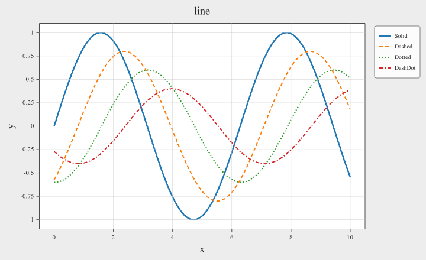

Line styles are `Solid`, `Dashed`, `Dotted`, `DashDot` and `None`. `None` draws
no stroke at all, and a series set to it drops out of the legend. Dashing is
honoured in the window, in PNG and in SVG alike.

`loop = true` adds one closing segment from the last point back to the first. It
adds no point, so limits, hover and the legend are unchanged, and a dash pattern
carries on across the seam.

Lines are the type that scales: a million points pans and zooms. There is no
marker option; use `scatter()` on the same data for a marked series.

### scatter

```cpp
Axes& scatter(std::span<const double> x, std::span<const double> y,
              ScatterOptions opts = {});
```

```cpp
ax->scatter(px, py, {.color = sextant::Color::Orange,
                     .size = 24.0f,
                     .marker = sextant::MarkerStyle::Diamond,
                     .alpha = 0.6f});
```

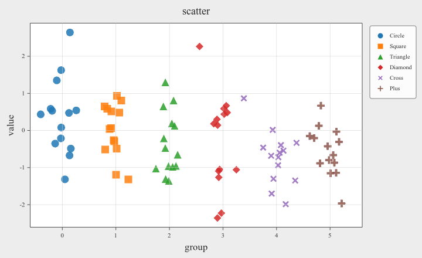

`size` is a diameter in pixels and does not change when you zoom. Markers:
`Circle`, `Square`, `Triangle`, `Diamond`, `Cross`, `Plus`, and `None`.

### scatter_z

A scatter whose colour carries a third value z.

```cpp
Axes& scatter_z(std::span<const double> x, std::span<const double> y,
                std::span<const double> z, ScatterZOptions opts = {});
```

```cpp
ax->scatter_z(x, y, temperature, {.vmin = -10.0f, .vmax = 40.0f,
                                  .colorbar = true, .name = "T (°C)"});
```

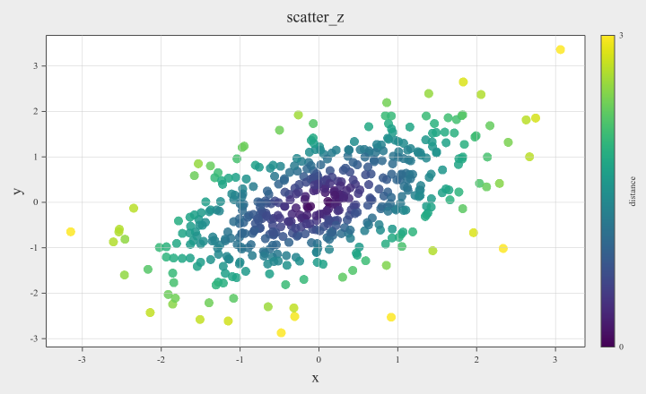

Each point's colour is `z[i]` mapped through `cmap`, `vmin` and `vmax`.
`colorbar = true` draws a bar explaining the mapping. `name` titles that bar and
also keys the series in the legend, as its marker shape filled white with a black
edge (the colour means nothing on its own).

### bar

```cpp
Axes& bar(std::span<const double> x, std::span<const double> height,
          BarOptions opts = {});
```

```cpp
ax->bar(months, balance, {.color = sextant::Color::Blue,
                          .width = 0.7f,
                          .name = "surplus",
                          .edgecolor = sextant::Color::Black});
```

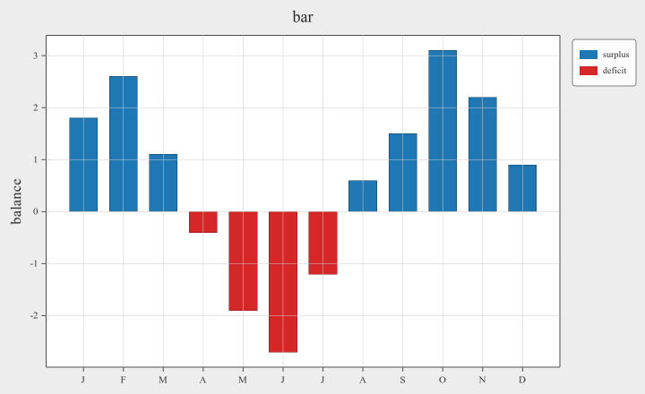

`width` is a fraction of the spacing between bars, so `1.0` makes them touch.
Negative heights draw downward from zero. Name the positions with
[`set_xticks()`](#titles-legends-colorbars-and-ticks).

### hist

A histogram is a bar plot whose bars come from binning, so it takes both option
structs:

```cpp
Axes& hist(std::span<const double> data, int bins = 10,
           BarOptions  bar_opts  = {.width = 1.0f},
           HistOptions hist_opts = {});
```

```cpp
ax->hist(a, 40, {.color = sextant::Color::Blue, .width = 1.0f, .alpha = 0.6f,
                 .name = "A"}, {.density = true})
   .hist(b, 40, {.color = sextant::Color::Orange, .width = 1.0f, .alpha = 0.6f,
                 .name = "B"}, {.density = true});
```

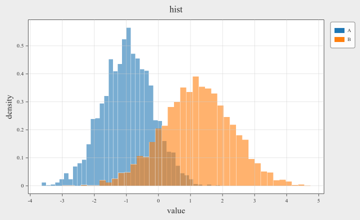

`BarOptions` says how the bars are *drawn*; `HistOptions` says what binning
means (`density`, `cumulative`). Here `width` is read against the **bin** width.

**One wart worth knowing.** `hist()`'s default argument raises `width` to `1.0`
so bins touch. If you pass your own `BarOptions` you get `BarOptions`' own
default of `0.8` back, and gapped bins read as a bar chart. Set `.width = 1.0f`
yourself whenever you pass bar options to `hist()`.

`hist()` takes no error bars: a bin height is a count sextant derived, not
something you measured.

### heatmap and imshow

```cpp
Axes& heatmap(std::span<const double> data, int rows, int cols,
              Range xrange, Range yrange, HeatmapOptions opts = {});

Axes& imshow(std::span<const double> data, int rows, int cols,
             HeatmapOptions opts = {});
```

```cpp
// Where the data lives in your own coordinates: a 90x140 grid over 400..700 nm.
ax->heatmap(field, 90, 140, {400.0, 700.0}, {-1.0, 1.0},
            {.cmap = sextant::Colormap::Inferno, .vmin = 0.0f, .vmax = 1.0f,
             .colorbar = true, .name = "intensity"})
   .set_xtitle("wavelength (nm)");

// Or, when the indices *are* the coordinates:
ax->imshow(field, rows, cols, {.colorbar = true});
```

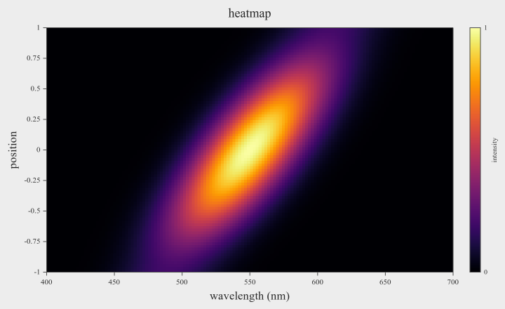

`data` is **row-major**, `rows * cols` values, indexed `row * cols + col`. Values
are stored in single precision.

`xrange` and `yrange` say where the image sits in data space. They are the
**outer edges** of the mesh, not cell centres, so a cell is `(hi - lo) / count`
across and a tick at 3 falls on the boundary between two cells. The mesh is
uniform; there is no per-cell coordinate vector. `imshow()` is the case
`{0, cols}` by `{0, rows}`: one unit per cell.

A reversed range (`lo > hi`) mirrors that axis. A degenerate (`lo == hi`) or
non-finite one throws.

Automatic limits never pad a heatmap: the image meets the frame edge, as
matplotlib's `imshow` does. Other data on the same axes is padded as usual, and
where it reaches past the image only its own side gets the room.

`origin` decides which end row 0 draws at: `"lower"` (default) puts it at the
bottom, `"upper"` at the top. The buffer layout does not change either way.

Hovering a cell reports its **row and column** and value, which under a real
extent are deliberately not the numbers on the axes.

---

## Error bars

An error bar decorates a series you already drew. Its **data** is an `ErrorBar`
passed just before the options; its **style** is the `errorbar` field of those
options. It is two shapes, either omittable:

- a **capped whisker**, for an observed range (`*_cap_lo`, `*_cap_hi`);
- a **box**, for a spread such as one standard deviation (`*_box_lo`, `*_box_hi`).

Every value is an **offset from the point**, not an absolute coordinate, and
magnitude-valued (a negative number is read as its size). Give one end only and
the bar is symmetric; give a zero and that side draws nothing, which is how you
make a one-sided bar. A NaN also leaves that side undrawn.

```cpp
// A whisker for the observed range and a box for one standard deviation:
ax->line(x, y, {.y_cap_lo = range_lo, .y_cap_hi = range_hi, .y_box_lo = sigma},
         {.color = sextant::Color::Blue, .name = "measured"});

// One-sided "at least this much": zeros below, arrow caps above.
ax->scatter(x, y, {.y_cap_lo = zeros, .y_cap_hi = up},
            {.errorbar = {.capstyle = sextant::CapStyle::Arrow}});

// Bars hang theirs off the tip, not the baseline:
ax->bar(centers, heights, {.y_cap_lo = err},
        {.errorbar = {.color = sextant::Color::Black, .capsize = 10.0f}});

// x and y at once; a box with both becomes a real 2D rectangle:
ax->scatter(x, y, {.x_box_lo = sx, .y_box_lo = sy});
```

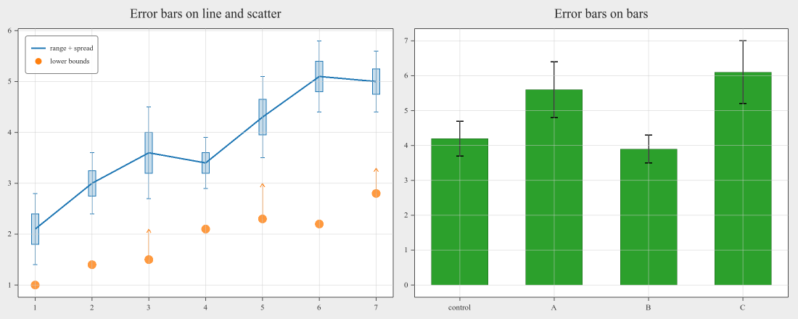

**Write the `ErrorBar` with field names.** A bare `{}` is ambiguous with the
overload that takes no error bars, and the fields are spans, so name vectors
rather than writing braced lists in place.

`line`, `scatter`, `scatter_z` and `bar` take error bars in both directions;
`hist` takes none. Every non-empty span must hold exactly one entry per point, or
the call throws. Without box data in a direction, the box is `boxwidth` pixels
across. Automatic limits widen to fit the bars, so nothing is clipped. Hovering a
point shows its offsets: `y=2.5 box ±0.3 cap +0.6/-0.5`.

The style fields (`color`, `linewidth`, `capsize`, `capstyle`, `boxwidth`,
`box_alpha`) are in [reference.md](reference.md#errorbaroptions). An unset colour
is the series' own (a bar's edge colour); for `scatter_z` it is black.

---

## Contours

A heatmap can trace iso-lines through itself.

```cpp
ax->heatmap(field, n, n, {-3.0, 3.0}, {-3.0, 3.0}, {
        .cmap = sextant::Colormap::Coolwarm, .vmin = -8.0f, .vmax = 8.0f,
        .colorbar = true,
        .contours = {-6, -4, -2, 0, 2, 4, 6},
        .contour_color = sextant::Color::from_hex(0x222222),
        .contour_labels = true});
```

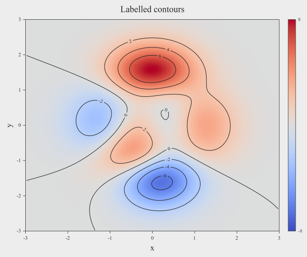

Levels are **z values in your data's own units**: the numbers the colorbar shows,
not a 0..1 scale. An empty list draws nothing and computes nothing. Levels are
sorted and de-duplicated for you; a non-finite one throws.

`contour_labels` writes each level onto its own line, rotated to follow it, with
the line broken to make room. A line too short to break keeps the line and drops
the label.

Lines pass through **cell centres**, so a contour stops half a cell inside the
image, and a heatmap smaller than 2×2 traces nothing. The traced geometry is in
data space, so it follows the extent you gave the heatmap. `origin` is honoured.

---

## Colormaps

Every colour-mapped kind takes a `Colormap`: `heatmap`, `scatter_z`, and in 3D
`surface`, `surface_tri`, `scatter3d` and `line3d`.

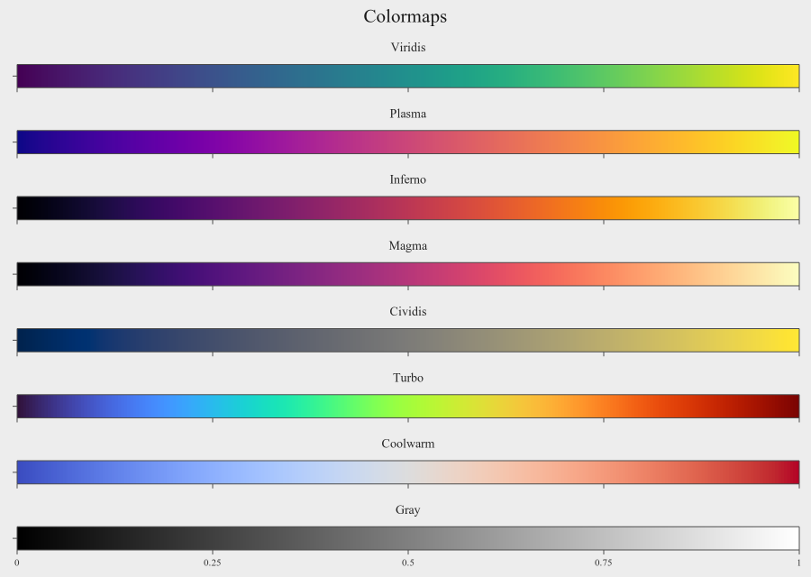

| | For |
|---|---|
| `Viridis` | The default. Perceptually uniform, readable in greyscale |
| `Plasma` | Like Viridis with more contrast |
| `Inferno`, `Magma` | Dark-to-bright; data that should glow against black |
| `Cividis` | Designed for colour-vision deficiency |
| `Turbo` | A rainbow for readers used to jet; not perceptually uniform |
| `Coolwarm` | Diverging: data with a meaningful centre, such as signed values |
| `Gray` | Greyscale images |

The colours match matplotlib's maps of the same names. `vmin` and `vmax` choose
the data range the map spans; values outside it take the end colours.

---

## Titles, legends, colorbars and ticks

```cpp
ax->set_title("Run 41", 18.0f)
   .set_xtitle("time (s)")
   .set_ytitle("voltage (V)")
   .set_xlim(0.0, 10.0)
   .set_ylim(-1.0, 1.0)
   .grid()
   .legend();

fig->suptitle("Experiment 7");     // one title over the whole subplot grid
```

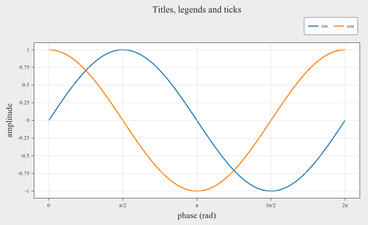

"Title" names an axis or the whole axes; "label" is the text under an individual
tick. `fontsize` is in pixels as drawn.

Limits are automatic until you set them. `set_xlim`/`set_ylim` pin them; error
bars are included when they are automatic.

**Legend.** A series appears in the legend when it has a non-empty `name` and
`show_legend` is left `true`. `legend()` places it: `LegendOptions::anchor` puts
it inside a corner of the frame (`InsideTL` … `InsideBR`, reserving no space) or
outside it (`OutsideRT` by default, and eleven others), where the plot shrinks to
make room.

```cpp
ax->legend({.anchor = sextant::LegendAnchor::InsideTL});
```

**Colorbars.** A colorbar appears because a plot object asked for one
(`colorbar = true` on a heatmap or `scatter_z`), and its `name` titles it along
the bar's outer side. Several can be asked for on one axes: each gets its own
bar, measured for its own numbers, stacked outward from the frame in plot order.
`set_colorbar_style()` styles all of an axes' bars, and chooses the side with
`ColorbarOptions::anchor` (`Left`, `Right`, `Top`, `Bottom`).

**Explicit ticks:**

```cpp
std::vector<double> days{0, 1, 2, 3, 4};
ax->set_xticks(days, {"Mon", "Tue", "Wed", "Thu", "Fri"});
ax->set_xticks(days);                // positions only, values as labels
```

The positions have to be a named array or vector, not a braced list written in
place: they arrive as `std::span<const double>`, and `std::span` gains a
constructor from `std::initializer_list` only in C++26. The labels are a
`std::vector<std::string>`, so those *can* be written inline. An empty span goes
back to automatic ticks.

`cla()` resets the axes completely: plot objects, limits, titles, styles, legend
and ticks. To change the data of a live plot, use
[`set_*_data()`](#live-updates-and-threads) instead, which keeps everything else.

> **Ordering gotcha.** `set_title(text, size)` stores its size in the axes style,
> so a later `set_axes_style()` resets it. Call `set_axes_style()` first.

---

## Styling

Colours are plain `{r, g, b, a}` floats in 0..1, with named constants and two
parsers:

```cpp
sextant::Color::Blue;                        // also Red Green Orange Purple
                                             // Cyan Black White Gray
sextant::Color::from_hex(0x1f77b4);          // 0xRRGGBB
sextant::Color::from_hex(0x1f77b480);        // 0xRRGGBBAA
sextant::Color::from_name("orange");         // or "#1f77b4"; throws on an unknown name
sextant::Color{0.2f, 0.4f, 0.9f, 0.5f};      // half-transparent blue
```

The named colours are matplotlib's tab10 palette, so `Color::Blue` is
`rgb(31,119,180)` rather than pure blue. `Black`, `White` and `Gray` are the
plain ones.

Four structs cover the rest, each applied through its own setter:

```cpp
ax->set_axes_style({.spine_color = sextant::Color::Gray,
                    .spine_top = false, .spine_right = false,
                    .label_fontsize = 13.0f,
                    .font_path = "C:/Windows/Fonts/times.ttf"});

ax->grid(true, {.color = {0.85f, 0.85f, 0.85f, 1.0f},
                .linestyle = sextant::LineStyle::Dashed});

ax->legend({.fontsize = 12.0f, .frameon = true});

ax->set_colorbar_style({.anchor = sextant::ColorbarAnchor::Bottom});
fig->set_suptitle_style({.fontsize = 26.0f, .align = sextant::HAlign::Left});
```

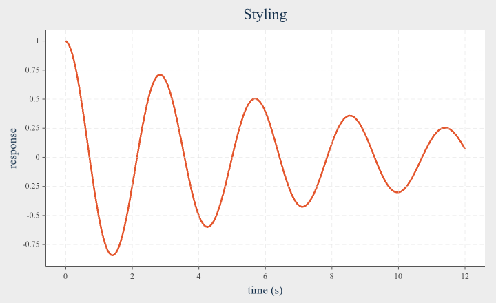

`font_path` is an absolute path to a `.ttf`/`.ttc`/`.otf`. Leave it empty for the
default, which sextant discovers from your system font directories. The legend,
colorbar and suptitle each have their own `font_path` and do **not** inherit the
axes one.

**Where the axes sit.** By default the x axis runs along the bottom of the frame
and the y axis up its left side. `AxesStyle` moves them: `xaxis_y` and `yaxis_x`
take `Low`, `Mid` or `High`, and `origin_x`/`origin_y` put them through a data
value, so `{.origin_x = 0.0, .origin_y = 0.0}` draws axes crossing at the origin,
matplotlib-style. On automatic limits, an origin outside the data widens the view
to include it. The four `spine_*` flags turn frame edges on and off
independently.

---

## Layout

### Subplots and spans

```cpp
auto fig = sextant::Figure::create({.width = 1000, .height = 620,
                                    .subplot_col_gap = 10.0f,
                                    .subplot_row_gap = 10.0f});

fig->add_subplot(2, 3, {1, 3})->line(x, y);   // the whole top row
fig->add_subplot(4)->hist(n, 30);             // the grid shape is known by now
fig->add_subplot(5)->bar(bx, bh);
fig->add_subplot(6)->heatmap(f, 40, 40, {-2, 2}, {-2, 2});
```

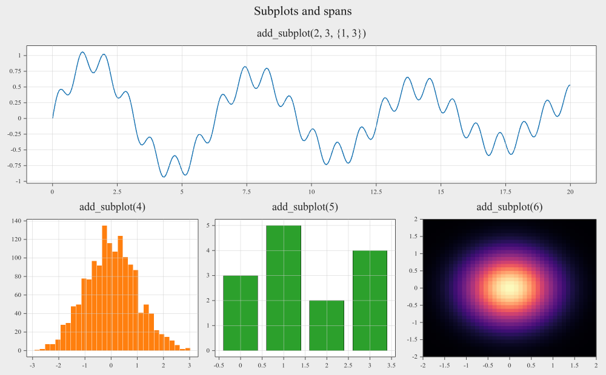

Cells are numbered `1..rows*cols`, row-major, like matplotlib. A `SubplotSpan`
`{first, last}` covers the rectangle from its top-left cell to its bottom-right
one (write it braced; a plain pair of ints would read as a grid shape).

A figure has **one grid shape**, fixed by the first call that gives one (`axes()`
counts as 1×1). After that, `add_subplot(index)` and `add_subplot({first, last})`
use it, and a different shape throws. Asking again for the same cell or span
returns what is there; any other request touching an occupied cell throws. A
span is addressed afterwards by its first cell.

The gaps separate *whole subplots*, labels and titles included. The space each
decoration needs is measured from its own text, so changing a font size moves the
text and the room made for it together; there is nothing to tune.

**Column and row weights** share out the grid unevenly:

```cpp
fig->set_col_ratios({2.0f, 1.0f, 1.0f});   // first column twice as wide
fig->set_row_ratios({1.0f, 2.0f});
```

A weight sizes the whole cell, decorations included, and a span gets the sum of
its weights. In the window, the boundary between two columns or rows can be
dragged, and a double-click evens it out.

`FigureMargins` is the border between the figure edge and the grid:

```cpp
fig->set_margins({.left = 20.0f, .right = 20.0f,
                  .top = 20.0f, .bottom = 20.0f});
```

### A 3D cell in the same grid

`add_subplot3d()` puts an `Axes3D` in a cell, under the same grid rules, so 2D
and 3D subplots sit side by side:

```cpp
fig->add_subplot(1, 2, 1)
    ->heatmap(cells, 60, 60, {-3.0, 3.0}, {-3.0, 3.0})
    .set_title("add_subplot: heatmap");

fig->add_subplot3d(1, 2, 2)
    ->surface(sextant::PlaneOrientation::XY, u, u, heights,
              {.colormap = true, .colorbar = true})
    .set_title("add_subplot3d: surface")
    .set_view(-55.0, 30.0);   // azimuth, elevation in degrees
```

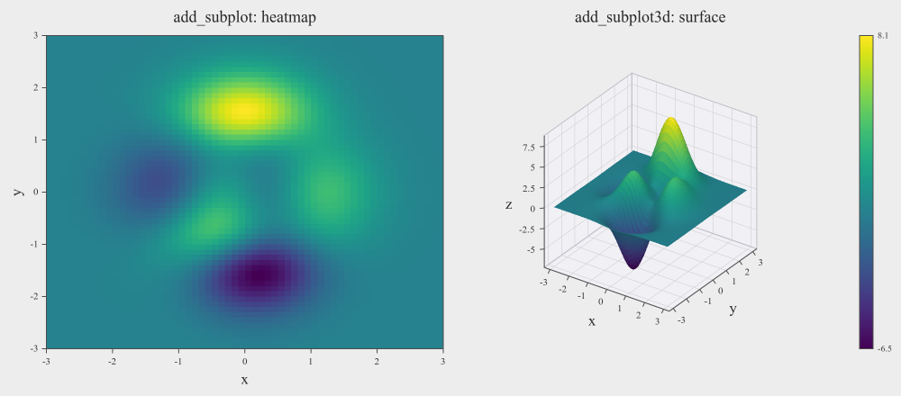

The two are siblings, not a hierarchy: an `Axes3D` is not an `Axes` and has its
own plot methods. Asking for a cell that already holds the other kind throws.
Everything about 3D is in **[3d.md](3d.md)**.

### Sizing a figure

Every size in sextant (`width`/`height`, font sizes, line widths, marker sizes,
margins) is a **logical pixel**, 1/96 inch. The window draws them at the
display's scale, so a figure looks the same on every monitor and sharper on a
high-DPI one. A PNG is written at `FigureOptions::dpi / 96` output pixels per
logical pixel: 96 (the default) gives an 800×600 file for an 800×600 figure,
192 twice that, with the same layout.

`FigureOptions::width`/`height` and `resize()` describe the **plot area**, which
is what `savefig()` writes. An open window grows by whatever its menu bar and
side panels occupy, so the plot lands on the size you asked for.

You can also work backwards from the data area you want:

```cpp
sextant::FigureSize s = fig->size_for_frame(400, 300);   // figure size for a
                                                         // 400x300 plot frame
fig->resize_to_frame(400, 300);                          // …and apply it
fig->resize_to_frame(400, 300, /*slot_index=*/2);        // of subplot 2
```

`slot_index` matters because a legend or colorbar is carved out of the cell that
owns it, so two subplots of one grid can have different frame sizes. The result
is exact apart from rounding to whole pixels.

---

## Saving to a file

```cpp
fig->savefig("plot.png");
fig->savefig("plot.svg");
```

The format comes from the extension; anything else throws. **No window is
required for either**: both work headless, and SVG needs no OpenGL context at
all, so it runs on a server with no display.

- **PNG** is supersampled and box-filtered, and matches the figure size exactly.
  `FigureOptions::supersample` sets the factor (default 2, max 4, 1 to disable);
  cost is quadratic.
- **SVG** is vector and resolution-independent, 3D scenes included. Text names a
  font family for the viewer to resolve, matching what the window draws.

Each format has its own entry point for the options only it has:

```cpp
fig->savefig_png("plot@2x.png", {.dpi = 192});          // twice the pixels
fig->savefig_png("small.png", {}, 640, 400);            // another size
sextant::SvgSaveReport r = fig->savefig_svg("scene.svg");
```

A 3D scene whose translucent objects interpenetrate is ordered per pixel in the
PNG and per polygon in the SVG, and both have a work bound. Hitting one is not an
error: the file is written, with part of it in plain depth order, and
`SvgSaveReport` (plus a line on `stderr`, and a comment in the file) says so and
names the number to raise. See [3d.md](3d.md#translucency-and-depth-order).

Saving does not need `refresh()` for your own calls. Edits made in the window
reach a caller's `savefig()` once `refresh()` has folded them in; the window's
own **File → Save** always saves what is on screen.

---

## The interactive window

`fig->show()` opens a window with a **Cosmetic** panel and a **Data** panel
docked beside the plot. It always runs on its own thread.

**Menus**

| | |
|---|---|
| **File → Save** | Write PNG or SVG at a chosen size, or at a chosen *plot-frame* size |
| **File → Resize to plot frame** | Resize the live window so a plot area hits a target |
| **File → Refit layout** | Re-measure tick labels after panning has widened them |
| **View → Cosmetic Panel / Data Panel** | Show or hide either panel |
| **Edit → Navigate** | Pan, zoom and orbit with the mouse |
| **Edit → Hints** | Hover for values (on by default) |
| **Subplot selector** | Which subplot the panels edit (with more than one) |

**Selecting a subplot.** Click a subplot to select it (it is outlined), or pick it
in the menu bar. The panels edit the selected subplot, and navigation acts on it.

**Navigating** (Edit → Navigate). In 2D, left-drag pans, the wheel zooms at the
cursor, and a double-click resets to the automatic limits. In 3D, left-drag
orbits, the wheel zooms, W/A/S/D/Q/E fly, and a double-click returns to the
default camera; see [3d.md](3d.md#camera).

**Hints** work over any subplot and read out the values under the cursor: `x` and
`y`, plus `z` for `scatter_z`, row, column and value for a heatmap, and the
offsets of a series with error bars. Give each point extra hover text with
`hint_labels`, index-aligned with your data:

```cpp
ax->line(x, y, {.hint_labels = {"", "", "Peak", "", "Trough"}});
```

**Cosmetic panel.** Titles, limits, ticks and tick labels, grid, frame and axis
positions, legend, colorbars, the suptitle, margins, gaps and grid weights, and
every colour and font size, all live. Each plot object's own appearance is in its
tab of the Data panel.

**Data panel.** One tab per plot object: its appearance (colour, width, marker,
colormap and so on) and its data as an editable table, with x/y/z columns side by
side and heatmap matrices as a grid. You can retype any value, insert and delete
points, insert and delete matrix rows and columns, and choose the numeric
notation and precision. Cells are tinted by where their value falls in their
column's range; *Shade cells* turns that off.

The panels' look is set once at creation, and they follow the monitor's DPI:

```cpp
sextant::Figure::create({.theme = sextant::PanelTheme::Dark,   // or Light,
                         .panel_width = 300.0f});              // Classic
```

---

## Live updates and threads

The window renders on its own thread from a snapshot of your data. Your thread
keeps the `Figure` and its axes, changes them, and publishes with `refresh()`:

```cpp
auto fig = sextant::Figure::create();
auto ax  = fig->axes();
ax->line(x, y, {.name = "u(t)"}).set_title("Simulation");
fig->show(false);                       // returns at once

while (!fig->wait_closed(1.0 / 60)) {   // until the user closes the window
    simulate_step(y);
    ax->set_line_data(0, x, y);         // replace series 0, keep everything else
    fig->refresh();                     // publish a new snapshot
}
```

**`set_<kind>_data(i, …)` replaces object `i`'s data in place** and keeps its
options, the axes' titles, limits and styles, and anything edited in the window.
It exists for every kind (`set_line_data`, `set_scatter_data`,
`set_scatter_z_data`, `set_bar_data`, `set_heatmap_data`, and the 3D ones), in two
forms: the plotting call's own arguments as spans, or the struct `<kind>_data(i)`
returns. It checks the data as the plotting call would and throws without
changing anything if it is bad. Error bars and `hint_labels` stay while the point
count is unchanged and are dropped otherwise.

**Waiting for the window.**

| | |
|---|---|
| `show(true)` (the default) | Blocks until you press ENTER at the console; the window keeps running |
| `show(false)` | Returns at once |
| `wait_closed(timeout_s)` | Returns `true` once this figure's window has closed, `false` if the timeout ran out first; negative waits forever. Any thread, any number of waiters |
| `Figure::run()` | Waits until every open figure in the process has closed |
| `Figure::poll_events()` | Pumps window events once; see macOS below |

**The rules:**

- **Change a figure and its axes, and call `refresh()`, `savefig()`, `resize()`
  and `close()`, from one thread**: the one that owns the `Figure`.
  `is_open()` and `wait_closed()` are safe from anywhere.
- `refresh()` throws `std::logic_error` before `show()` or after the window has
  closed.
- **Edits made in the window survive `refresh()`**: typed titles, a panned view,
  retyped data, styles, all of it. When both you and the user change the same
  thing, the later change wins: a `set_xlim()` after the user panned replaces the
  pan, and a pan after your `set_xlim()` replaces that. `cla()` resets everything,
  window edits included.
- **macOS**: window events belong to the main thread there. Call `poll_events()`
  in any loop that holds a window up on the main thread (it does nothing on
  Windows and Linux, so the loop stays portable), or use `wait_closed()`/`run()`,
  which pump while they wait. `poll_events()` throws `std::logic_error` off the
  main thread. `show(true)` on the main thread keeps the window live while it
  waits for ENTER.

`frame_stats()` reports render timing, cumulative since `show()`:

```cpp
auto a = fig->frame_stats();
/* … */
auto b = fig->frame_stats();
double ms_per_frame = (b.total_ms - a.total_ms) / (b.frames - a.frames);
```

It measures render work and excludes the vsync-blocking buffer swap, so
`b.frames` over wall time is the rate actually achieved while `total_ms` is what
scales with your data size. Set `FigureOptions::vsync = false` to measure
end-to-end cost.

---

## Reading back

`Axes`, `Plane2D` and `Axes3D` report what they hold now, including edits made in
the window once `refresh()` has folded them in:

```cpp
std::string t = ax->title();          // also xtitle(), ytitle()
sextant::Range xr = ax->xlim();        // as drawn: set, panned, or automatic
std::size_t n = ax->line_count();
sextant::LineData d = ax->line_data(0);   // a copy: d.x, d.y
```

Every kind has a `<kind>_count()` and a `<kind>_data(i)` returning a copy in a
struct named after the kind (`LineData`, `ScatterData`, `ScatterZData`,
`BarData`, `HeatmapData`; in 3D `Bar3DData`, `SurfaceData`, `SurfaceTriData`,
`Scatter3DData`, `Line3DData`), with fields named after the plotting call's
arguments. `bar_data` covers `hist()` too (bin centres and heights), and
`heatmap_data` covers `imshow()`. An index past the count throws
`std::out_of_range`. Styles, error bars and `hint_labels` are not read back.

The structs are exactly what `set_<kind>_data()` takes, so read, edit, write back
is three lines:

```cpp
auto d = ax->line_data(0);
for (double& v : d.y) v *= 2.0;
ax->set_line_data(0, d);
```

---

## Errors

sextant throws standard exceptions; it never aborts. Anything that would silently
draw a misleading plot is an exception rather than a best guess.

| Thrown | When |
|---|---|
| `std::invalid_argument` | Mismatched lengths (`x`/`y`, `x`/`y`/`z`, `x`/`height`). An error-bar span that is not one entry per point. Heatmap `rows`/`cols` not positive, data too small, or a degenerate or non-finite range. A non-finite contour level. An invalid subplot index, a different grid shape, a cell already taken, a shape-less `add_subplot()` before any shape. Invalid grid weights. A non-positive size or dpi. An unknown `savefig` extension. A bad colour name or hex string. In 3D, see [3d.md](3d.md#errors) |
| `std::out_of_range` | A read-back or `set_*_data()` index past the count |
| `std::logic_error` | `refresh()` before `show()` or after the window closed; `poll_events()` off the main thread on macOS |
| `std::runtime_error` | The window or OpenGL context could not be created |
| `std::system_error` | Writing a file failed |

Non-fatal warnings (a missing font, an export that hit its work bound) go to
`stderr`.

---

## Linking

```cmake
list(APPEND CMAKE_PREFIX_PATH "/path/to/sextant/dist")   # where you installed it
find_package(sextant CONFIG REQUIRED)
target_link_libraries(my_app PRIVATE sextant::sextant)
```

`sextant::sextant` is the shared library. Building against it needs only the installed package: none of sextant's dependencies have to be on your machine. On Windows, copy `sextant.dll` next to your executable.

`sextant::sextant_static` links statically instead, and your project then resolves FreeType, libpng and GLFW itself.

The [build guide](build.md) covers installing, finding the library at runtime on each platform (with a copy step for Windows), and [linking statically](build.md#linking-statically), including the vcpkg triplet to pin.
